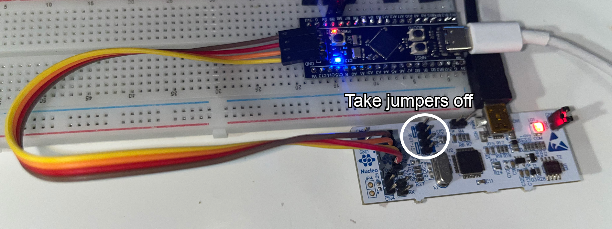
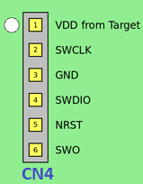

# Flashing
STM32f411CEU6 microcontroller doesn't come with a programmer/debugger on board. Thus, external ST-Link is required to flash the software.

## Using Nucleo ST-Link
1. Take off the jumpers from ST-Link's CN2 connector

<p align="center">

</p>

2. Connect the first 4 pins of the CN4 connector to microcontroller:
    * VDD   <-> 3V3
    * SWCLK <-> SWCLT
    * GND   <-> GND
    * SWDIO <-> SWDIO

<p align="center">

</p>

<p align="center">

</p>

Connect the ST-Link and the MCU into your PC using USB cables and run the following command from command-line inside cansat repository:

```
cargo xtask embed
```

## Using standalone ST-LINK
1. Connect the vires according to schematic below:
<p>

</p>

2. Connect the ST-Link and the MCU into your PC using USB cables and run the following command from command-line inside cansat repository:

```
cargo xtask embed
```

## Using DFU
This should work right away on Linux.
On windows you have to download LibusbK (you can pick it in Zadig program).


**Info: libusb-win32 did not work when testing**

Run:
```
cargo install cargo-dfu
```
Connect your board to USB, hold BOOT0 button, press NRST button and release BOOT0 button. This should run the MCU in bootloader mode.
**The blue LED will not flash when inside this mode. Red LED will be on constantly**

Change directory to the project you want to flash, e.g
```
cd crates/cansat-stm32f4
```
and run 
```
cargo dfu
```

### Troubleshooting
If your device is not properly recognized by your system, try to disconnect all serial peripherals and repeat.


