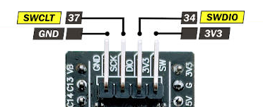

# Flashing
STM32f411CEU6 microcontroller doesn't come with a programmer/debugger on board. Thus, external ST-Link is required to flash the software.

## Using Nucleo ST-Link
1. Take off the jumpers from ST-Link's CN2 connector

<p align="center">

</p>

2. Connect the first 4 pins of the CN4 connector to microcontroller:
    * VDD   <-> 3V3
    * SWCLK <-> SWCLT
    * GND   <-> GND
    * SWDIO <-> SWDIO

<p align="center">

</p>

<p align="center">

</p>

Connect the ST-Link and the MCU into your PC using USB cables and run the following command from command-line:

```
cargo xtask embed cansat-stm32f4
```
