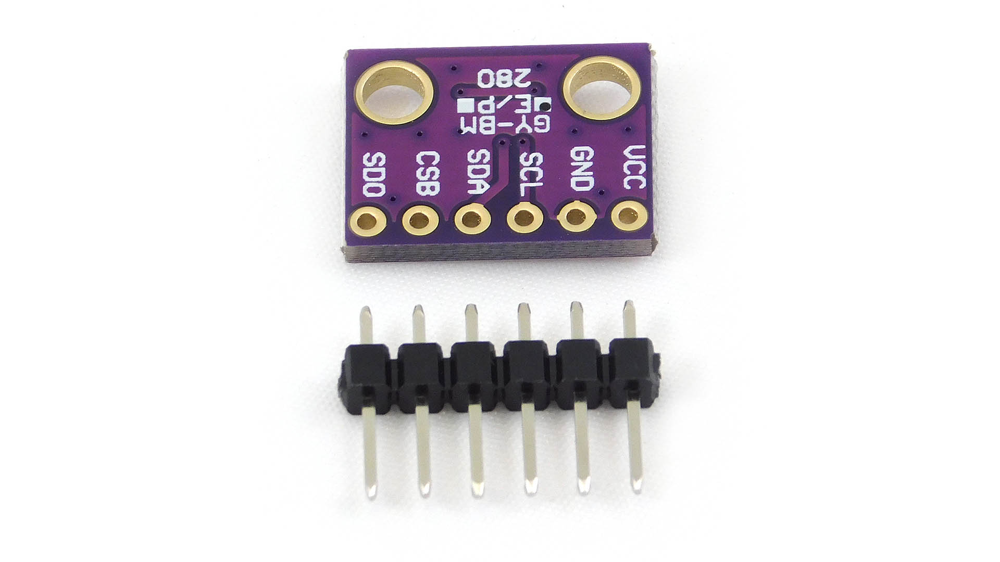
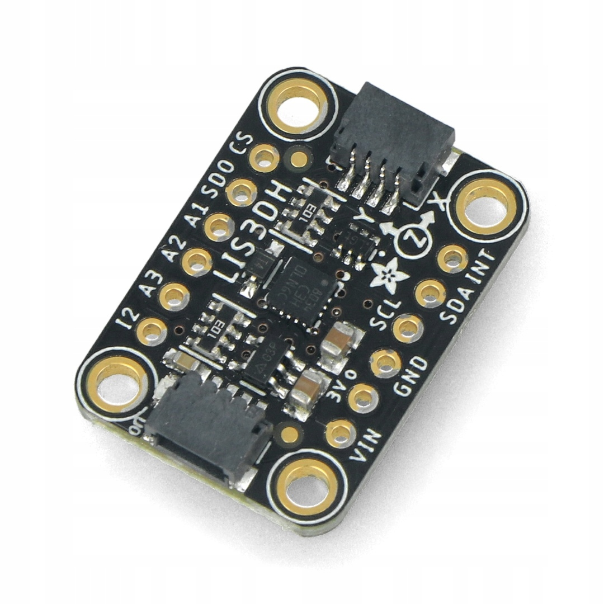
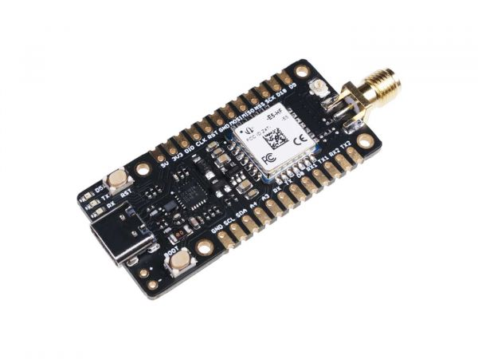
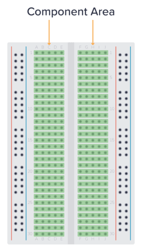
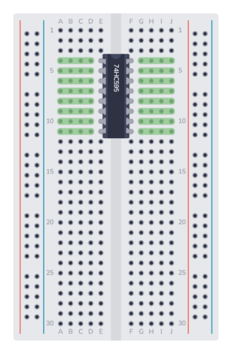
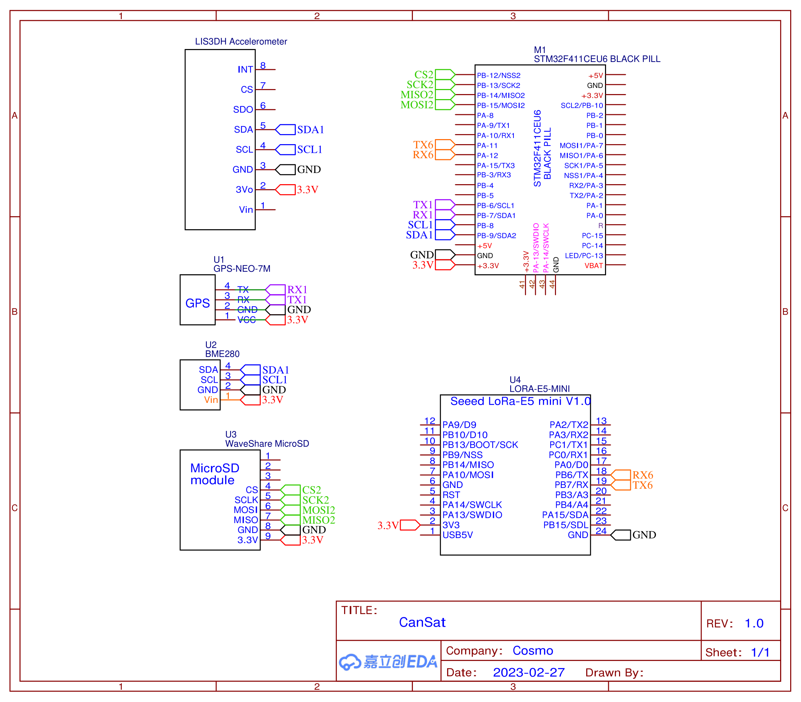
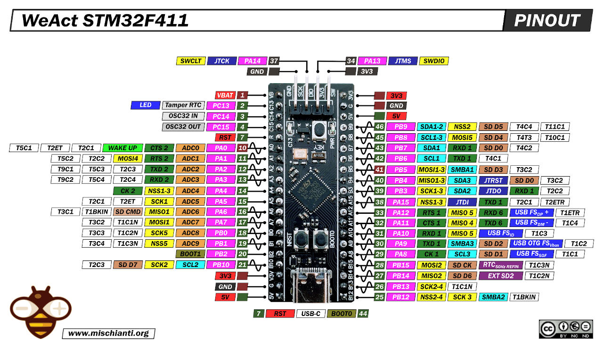

# Get to know your hardware
* Microcontroller: [STM32F411CEU6](https://www.st.com/en/microcontrollers-microprocessors/stm32f411ce.html)

* GPS: [Velleman WPI430 U-BLOX NEO-7M](https://www.velleman.eu/products/view/?id=460512)

* Temperature and pressure sensor: [Bosch BME280](https://www.bosch-sensortec.com/products/environmental-sensors/humidity-sensors-bme280/)

* MicroSD card reader: [WaveShare 3947](https://www.waveshare.com/micro-sd-storage-board.htm)

* Accelerometer: [ST LIS3DH](https://www.st.com/en/mems-and-sensors/lis3dh.html)

* LoRa: [seeed studio WIo-E5 mini](https://www.seeedstudio.com/LoRa-E5-mini-STM32WLE5JC-p-4869.html)

# Connect it all together

## Connections schematic

## STM32f411CEU6 Pinout

